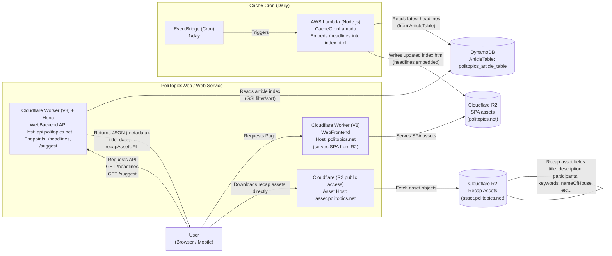

# PoliTopics Web

[日本語版](./docs/jp/README.md)

Next.js SPA on Cloudflare R2, Hono API on Cloudflare Workers (V8), with a daily cache cron on AWS Lambda. Assets are served from R2; metadata is read from DynamoDB.

## Architecture



## Components

- `frontend/`: Next.js SPA, exported to static assets in R2.
- `workers/backend/`: Hono API on Cloudflare Workers V8 (`/healthz`, `/headlines`, `/suggest`, `/article/:id`).
- `cacheCron/`: AWS Lambda that embeds cached headlines into `index.html` daily.
- Shared infra: Terraform for DynamoDB/R2 wiring; LocalStack for DynamoDB in local dev.

## Commands

- Install: `npm install --workspaces --include-workspace-root`
- Dev (mockDB + nextjs(for hot reload) + Workers): `npm run dev:nextjs:honoserver`
- E2E (LocalStack + Workers): `npm run test:e2e:localstack`

## Environment

- Frontend: `NEXT_PUBLIC_APP_ENV`, `NEXT_PUBLIC_API_BASE_URL`, `NEXT_PUBLIC_LOG_LEVEL`
- Backend worker (Hono):
  - `APP_ENV` (`local`|`localstack`|`stage`|`prod`)
  - AWS: `AWS_REGION`, `AWS_ACCESS_KEY_ID`, `AWS_SECRET_ACCESS_KEY`, `DYNAMODB_TABLE_NAME`, `S3_ASSET_BUCKET`
  - LocalStack overrides: `LOCALSTACK_URL` or `AWS_ENDPOINT_URL`, plus optional `DYNAMODB_ENDPOINT_URL`, `S3_ENDPOINT_URL`, `S3_FORCE_PATH_STYLE`
- Cache cron: uses AWS env + DynamoDB table + R2 SPA bucket (see `cacheCron/.env.example`)
- Tip: `source ../scripts/export_test_env.sh` to load LocalStack defaults before running tests.

## Local flows

Frontend + Worker:

```bash
npm run dev:localstack
```

LocalStack DynamoDB must be running (root `docker-compose.yml`).

Full LocalStack E2E:

```bash
npm run test:e2e:localstack
```

## Deploy

- SPA: GitHub Actions `.github/workflows/deploy-frontend.yml` builds with `NEXT_PUBLIC_API_BASE_URL` from Terraform outputs and syncs to R2.
- Worker: `.github/workflows/deploy-backend-worker.yml` deploys Hono API to Cloudflare Workers (stage/prod).
- Cache cron: deployed via Terraform under `cacheCron` / `terraform`.

## Data sources

- Metadata: DynamoDB (`politopics-article-table` per env)
- Assets: Cloudflare R2 public URLs (recap asset JSON)
- SPA: Cloudflare R2 bucket served by Workers

## Observability

- Workers log to Cloudflare; cache cron logs to CloudWatch; LocalStack logs for local runs.
- Discord webhooks for error/warn/access (Worker) and for cache cron failures (through shared variables).
