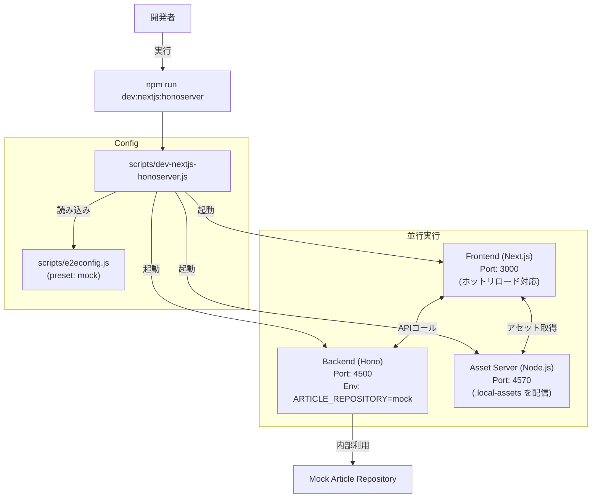
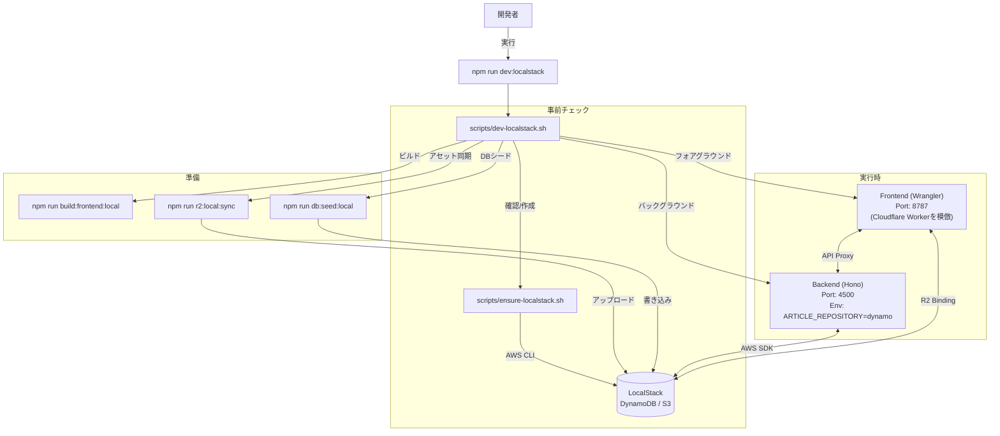
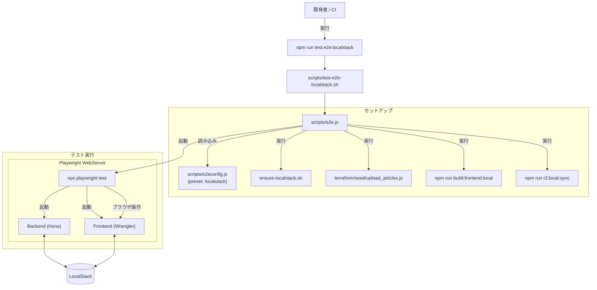

# スクリプト利用フロー

`PoliTopicsWeb` における主要な開発・テスト用スクリプトの実行フローとコンポーネント間の連携を図解します。

## 1. モック開発モード
**コマンド:** `npm run dev:nextjs:honoserver`
**ユースケース:** 外部依存（Docker/LocalStack）なしでの高速なUI/ロジック開発。インメモリのモックデータを使用します。

## 2. LocalStack 開発モード
**コマンド:** `npm run dev:localstack`
**ユースケース:** ローカル環境での「リアルな」AWSサービスとの統合テスト。DynamoDBとS3にLocalStackを使用し、本番に近い構成（Wrangler）で動作させます。

## 3. E2E テストモード
**コマンド:** `npm run test:e2e:localstack`
**ユースケース:** Playwright を使用した、LocalStack 環境全体に対する自動 E2E テスト。

