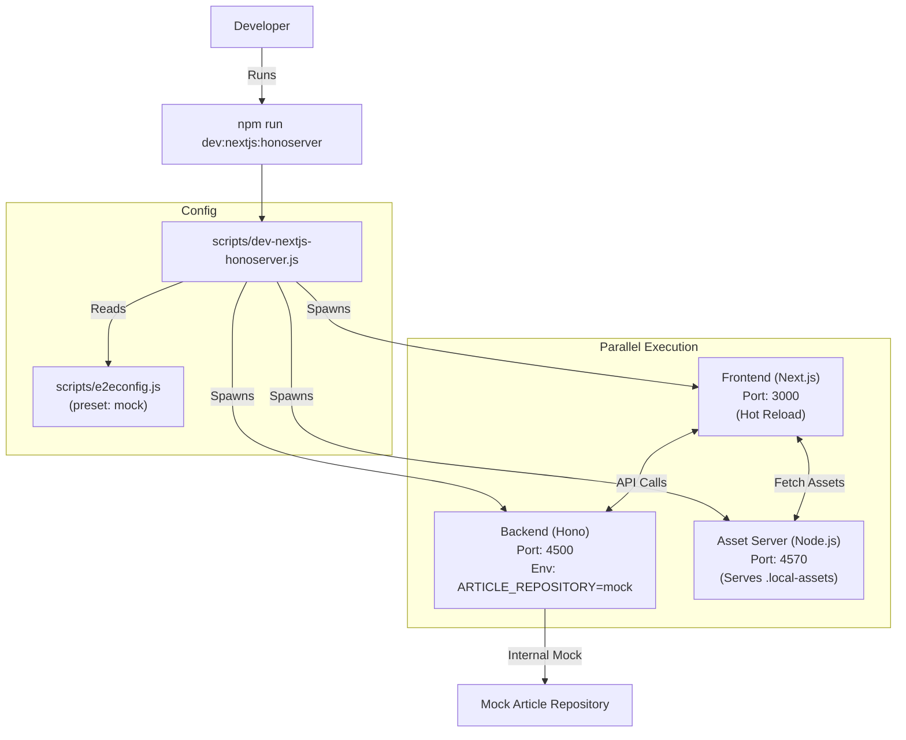
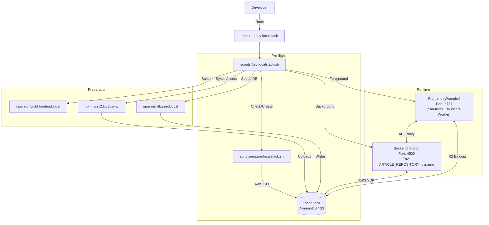
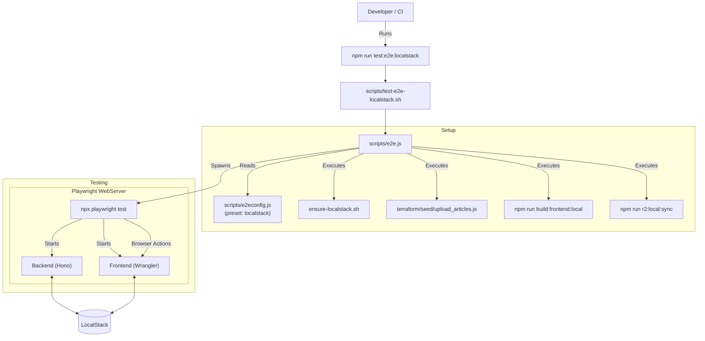

# Script Usage Flows

This document illustrates the execution flow and component interaction for the primary development and testing scripts in `PoliTopicsWeb`.

## 1. Mock Development Mode

**Command:** `npm run dev:nextjs:honoserver`
**Use Case:** Rapid UI/Logic development without external dependencies (Docker/LocalStack). Uses in-memory mock data.

## 2. LocalStack Development Mode

**Command:** `npm run dev:localstack`
**Use Case:** Integration testing with "real" AWS services locally. Uses LocalStack for DynamoDB and S3. Frontend is served via Cloudflare Wrangler to mimic production.

## 3. E2E Test Mode

**Command:** `npm run test:e2e:localstack`
**Use Case:** Automated End-to-End testing using Playwright against a full LocalStack environment.

