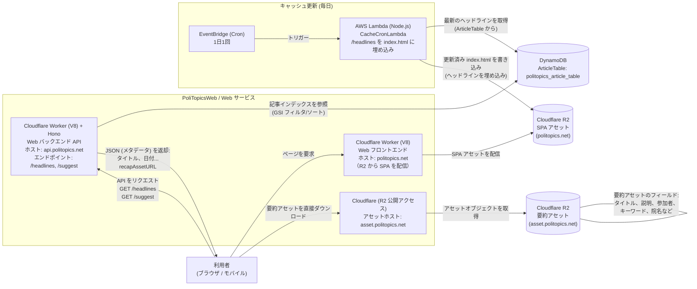

# PoliTopics Web
[English Version](../README.md)

PoliTopics の公開体験を提供する Web サービスです。Next.js SPA を Cloudflare R2 に配置し、Hono で書かれた Cloudflare Workers (V8) API を介して DynamoDB からメタデータを返します。記事アセットは R2 から配信し、ヘッドラインは AWS Lambda のキャッシュ cron で埋め込みます。

## アーキテクチャ



## コンポーネント
- `frontend/`: Next.js SPA（R2 に静的配信）。
- `workers/backend/`: Cloudflare Workers V8 上の Hono API (`/healthz`, `/headlines`, `/suggest`, `/article/:id`)。
- `cacheCron/`: 毎日 `index.html` にヘッドラインを埋め込む AWS Lambda。
- Terraform: DynamoDB/R2 などの配線。ローカルは LocalStack で DynamoDB を使用。

## コマンド
- インストール: `npm install --workspaces --include-workspace-root`
- LocalStack + Workers 起動: `npm run dev:localstack` (ポート 4500/8787)
- E2E: `npm run test:e2e:localstack` (LocalStack + Workers + Playwright)

## 環境変数
- フロントエンド: `NEXT_PUBLIC_APP_ENV`, `NEXT_PUBLIC_API_BASE_URL`, `NEXT_PUBLIC_LOG_LEVEL`
- Worker バックエンド (Hono):
  - `APP_ENV` (`local`|`localstack`|`stage`|`prod`)
  - AWS: `AWS_REGION`, `AWS_ACCESS_KEY_ID`, `AWS_SECRET_ACCESS_KEY`, `DYNAMODB_TABLE_NAME`, `S3_ASSET_BUCKET`
  - LocalStack 上書き: `LOCALSTACK_URL` または `AWS_ENDPOINT_URL`, `DYNAMODB_ENDPOINT_URL`, `S3_ENDPOINT_URL`, `S3_FORCE_PATH_STYLE`
- キャッシュ cron: AWS 環境 + DynamoDB テーブル + R2 SPA バケット（`cacheCron/.env.example` を参照）
- ヒント: `source ../scripts/export_test_env.sh` を実行すると LocalStack 用デフォルトを一括設定できます。

## ローカルフロー
フロント + Worker:
```bash
npm run dev:localstack
```
LocalStack の DynamoDB を起動しておく（リポジトリルートの `docker-compose.yml`）。

完全な LocalStack E2E:
```bash
npm run test:e2e:localstack
```

## デプロイ
- SPA: GitHub Actions `.github/workflows/deploy-frontend.yml` が Terraform 出力の `NEXT_PUBLIC_API_BASE_URL` でビルドし、R2 に同期。
- Worker: `.github/workflows/deploy-backend-worker.yml` が Hono API を Cloudflare Workers（stage/prod）にデプロイ。
- Cache cron: `cacheCron/terraform` でデプロイ。

## データソース
- メタデータ: DynamoDB (`politopics-article-table` 各環境)
- アセット: Cloudflare R2 の公開 URL (recap asset JSON)
- SPA: Cloudflare R2 バケットを Workers が配信

## オブザーバビリティ
- Workers は Cloudflare にログ送信、キャッシュ cron は CloudWatch、ローカルは LocalStack ログ。
- Discord Webhook: Worker の error/warn/access、cache cron の失敗通知で使用。
